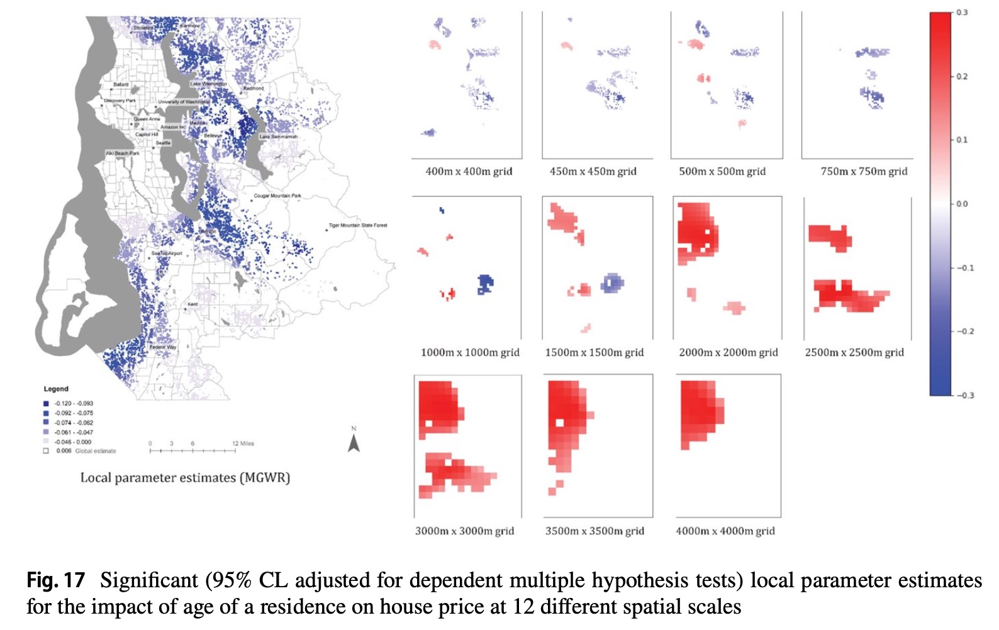

## 목차

1. 연구 개요
2. 연구 질문
3. 시뮬레이션 설계
4. 국지적 모형과의 연관성
5. 실증 분석
6. 논의 사항

---

## 연구 개요

**현상 및 기존 연구의 한계**

- OLS(전역)와 GWR/MGWR(국지) 간 회귀계수 **부호 역전** = 공간적 심슨의 역설, *spatial variant of Simpson's Paradox* (FS2022; SF2023)

{width="80%"}

---

## 연구 개요

**현상 및 기존 연구의 한계**

- 기존 결론: "전역·국지 모형은 서로 다른 질문(프로세스)에 대한 답"
- 예시: 운동(X)과 피부암 발생률(Y), 태양 노출 빈도(Z)의 관계
- '**어떤 조건에서** 국지 모형의 의미가 더 크다고 할 수 있는가?' → 전역적/국지적 모형 결과 달라지는 양상 파악 필요

---

## 연구 개요

**본 연구의 접근**

- 관측되지 않은 **교란변수 Z**를 DGP에 명시적으로 도입하여 시뮬레이션 진행 (X와의 관련성 / Z의 공간적 군집 정도)
- GWR, SGWR이 각각 어떤 조건에서 Z를 **간접적으로 통제**하는지 파악
→ 국지적 모형 해석 및 선택에 대한 함의 도출
- 실증 분석 사례로부터 확인

---

## 연구문제

| # | 구분 | 연구문제 | 가설 |
|---|------|---------|------|
| RQ1 | 발생 조건 | Z의 공간적 자기상관(ρₛ)과 X-Z 상관(α)이 역설 발생에 미치는 영향 | ρₛ↑, α↑ → 역설 강해짐 |
| RQ2 | GWR 역할 | Z가 공간적으로 군집 시, GWR 추정치는? | OLS보다 β_true에 근접 |
| RQ3 | SGWR 역할 | Z 군집 약해도 W가 Z의 대리변수일 때 SGWR은? | GWR보다도 β_true에 근접 |
| RQ4 | 실증 | 출산력 데이터의 역전이 RQ1–3 조건에 해당? | — |

---

## 연구방법: 시뮬레이션 설계 {.smaller}

**4단계 DGP**

::: {.panel-tabset}

### 1단계: True DGP
$$Y_i = \beta_{true} \times X_i + \gamma \times Z_i + \epsilon_i$$

- $\beta_{true} = 0$으로 설정 시 X–Y 간 실제 관계 없음
- Z는 관측되지 않는 교란변수

### 2단계: Z의 공간 분포
Z 생성 방법 (택일):

- **가우시안 랜덤 필드**: 대역폭 $h$가 클수록 군집↑
- **모런 고유벡터**: 고유값 순위($\rho_s$)가 클수록 군집↑

### 3단계: X–Z 상관
$$X_i = \alpha \times Z_i + \eta_i$$

- $\alpha$ 클수록 거짓 상관 강함
- $\alpha = 0$이면 역설 발생 안 함

### 4단계: W–Z 상관
$$W_i = \delta \times Z_i + \nu_i$$

- $\delta$ 클수록 W가 Z의 좋은 대리변수
- SGWR의 속성 유사성이 Z를 간접 통제 가능

:::

---

## 실험 조건 및 예상 결과

| $\rho_s$ | $\alpha$ | $\delta$ | 예상 결과 |
|---------|---------|---------|----------|
| 높음 | 높음 | — | **GWR이 역설 완화** |
| 낮음 | 높음 | 낮음 | GWR, SGWR 모두 완화 실패 |
| 낮음 | 높음 | 높음 | **SGWR만 역설 완화** |
| — | 낮음 | — | 역설 발생 안 함 |

---

## 평가 지표

$$\text{Bias} = \frac{1}{n}\sum_i |\hat{\beta}_i - \beta_{true}|$$

$$\text{Bias Reduction} = \frac{|\widehat{\beta_{OLS} - \beta_{true}}| - |\widehat{\beta_{local} - \beta_{true}}|}{|\widehat{\beta_{OLS} - \beta_{true}}|}$$

부호 역전 비율: $\hat{\beta}$의 부호가 $\widehat{\beta_{OLS}}$와 반대인 관측치 비율

---

## Toy Example

관측치 6개, 집단 2개 (맑은 도시 A, 흐린 도시 B)

| 관측치 | 도시 | Z (태양노출) | X (운동) | Y (피부암) |
|:------:|:----:|:----------:|:-------:|:---------:|
| 1 | A | 10 | 8 | 10 |
| 2 | A | 10 | 6 | 10 |
| 3 | A | 10 | 4 | 10 |
| 4 | B | 2  | 3 | 2 |
| 5 | B | 2  | 1 | 2 |
| 6 | B | 2  | 2 | 2 |

**DGP**: `Y = 0*X + 1*Z + eps` ($\beta_{true}=0$, 운동은 피부암과 무관)

- X와 Y만 보면 OLS는 **양의 상관**을 추정
- Z를 통제하면 $\hat\beta_{i} \simeq 0$ 

---

## 시뮬레이션 결과 (모의) {.smaller}

30×30 격자, $\beta_{true}=0$, $\gamma=5$, 고정 대역폭 $h_{bw}=2$

| 조건 | $h$ | $\alpha$ | $\delta$ | OLS | GWR 평균 | GWR Bias↓ | SGWR 평균 | SGWR Bias↓ |
|:----:|:---:|:---:|:---:|:---:|:---:|:---:|:---:|:---:|
| Cond1 | 6.0 | 5.0 | — | +0.994 | +0.971 | **+2.4%** | +0.995 | −0.0% |
| Cond2 | 0.5 | 5.0 | 0.5 | +0.995 | +0.995 | 0.0% | +0.987 | +0.8% |
| Cond3 | 0.5 | 5.0 | 5.0 | +1.001 | +1.001 | 0.0% | +0.990 | **+1.2%** |
| Cond4 | 2.0 | 0.0 | — | −0.483 | −0.424 | — | −0.361 | — |

::: {.callout-note}
Cond1·3에서 예상 방향의 편향 감소 확인 (개선 폭 미미) · Cond4($\alpha=0$): OLS 자체가 노이즈에 의한 허위 추정치, GWR/SGWR에서 부호 역전 양상 · 대역폭 설정 및 DGP 조건 추가 검토 필요
:::

---

## 실험 조건 및 예상 결과

| $\rho_s$ | $\alpha$ | $\delta$ | 예상 결과 |
|---------|---------|---------|----------|
| 높음 | 높음 | — | **GWR이 역설 완화** |
| 낮음 | 높음 | 낮음 | GWR, SGWR 모두 완화 실패 |
| 낮음 | 높음 | 높음 | **SGWR만 역설 완화** |
| — | 낮음 | — | 역설 발생 안 함 |

---

## 논의 사항

::: {.incremental}
- 타당성: 국지적 모형(GWR, SGWR)의 해석가능성? '인과' 프레임워크와의 구분
- 실제 분석 상황: DGP를 모르는 상태
- 적절한 실증 분석 데이터셋 찾기
- 분석 모형의 문제: (M-)SGWR 패키지
:::

---

## 참고문헌 {.smaller}

- Bickel et al. (1975). Sex bias in graduate admissions. *Science*, 187, 398–404.
- Brunsdon et al. (1996). Geographically weighted regression. *Geographical Analysis*, 28, 281–298.
- Fotheringham & Sachdeva (2022). Scale and local modeling. *Journal of Geographical Systems*, 24, 475–499.
- Fotheringham et al. (2017). Multiscale GWR (MGWR). *Annals AAG*, 107, 1247–1265.
- Lee, S-I. (2001). A spatial statistical approach to migration studies. *KARG*, 7(3), 107–120.
- Lessani & Li (2024). SGWR. *IJGIS*, 38(7), 1232–1255.
- Lessani et al. (2026). M-SGWR. *arXiv*.
- Pearl, J. (2000). *Causality*. Cambridge University Press.
- Sachdeva & Fotheringham (2023). A geographical perspective on Simpson's paradox. *JOSIS*, 26, 1–25.
- Simpson, E. H. (1951). The interpretation of interaction in contingency tables. *JRSS-B*, 13, 238–241.
