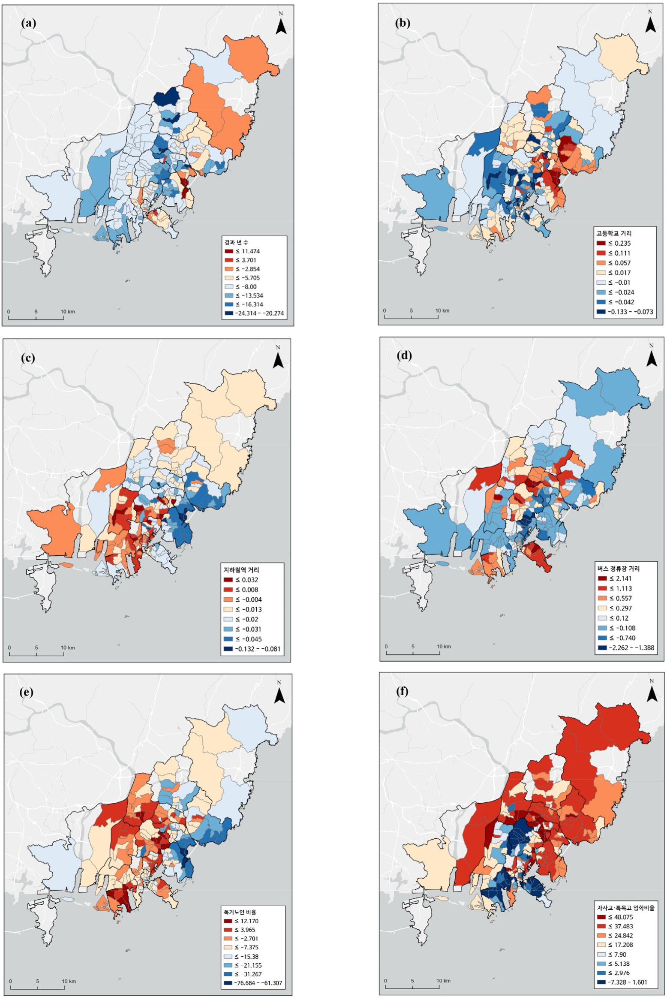

# 연구 배경 및 동기

- 국지적 회귀모형(e.g. GWR)이 나타내는 '회귀계수의 공간적 이질성' -- 실제로 이질성의 정도가 그러한가? (model misspecification 문제)
- GWR은 지리적 인접성에 따른 부드러운 공간적 영향을 가정한다. 이러한 공간 체제 가정이 적합 결과에 어떤 영향을 미치는가? 다른 가정에 기반한 R-GWR(불연속적, 행정구역 경계), SGWR(속성 유사성 결합)는 어떠한 양상을 보이는가? 각 모형은 어떤 상황에서 가장 잘 작동하는가 (혹은 잘 작동하지 않는가)?
- 기타 GWR과 관련된 문제들 (응용 연구에서 나타나는 추정 결과 해석 문제)

---

# 문헌 검토

## Spatial Simpson's Paradox

> Sachdeva, M., & Fotheringham, A. S. (2023). A geographical perspective on Simpson's paradox. Journal of Spatial Information Science, 26, 1–25.

- 전역적 모형과 국지적 모형 간의 회귀계수 방향이 바뀌거나, 유의성이 달라지는 현상
- 비공간적 Simpson's Paradox의 spatial variant
- 해당 논문의 관점: 전역적 모형과 국지적 모형은 서로 다른 작동 스케일의 공간적 프로세스를 포착하는 것이므로, 모순이 아니라는 해석

## Endogeneous Spatial Regimes

>  Anselin, L., & Amaral, P. (2024). Endogenous spatial regimes. Journal of Geographical Systems, 26(2), 209–234.

- 공간계량경제학에서의 공간적 이질성을 다루는 방식에 관한 review: 데이터에 기반하여 공간 체제의 분할(delineation)과 계수 추정을 진행하는 **endogenous spatial regimes** 접근법 소개 (혼합모형, GWR-기반 모형, 벌점 회귀모형, 지역화 모형)
- 공간 제약하의 군집 알고리즘(SKATER)을 이용한 방식 제시

## Spatial Confounding

>  Hodges, J. S., & Reich, B. J. (2010). Adding spatially-correlated errors can mess up the fixed effect you love. The American Statistician, 64(4), 325–334.

>  Paciorek, C. J. (2010). The importance of scale for spatial-confounding bias and precision of spatial regression estimators. Statistical Science, 25(1), 107–125.

- 공간 교란(spatial confounding): 공변량 $X$와 미관측 교란요인 $Z$가 공간상에서 함께 구조화되어 있을 때, 공간 임의효과와 $X$ 사이의 collinearity로 인해 임의효과가 $Z$의 신호뿐 아니라 $X$의 신호까지 흡수함으로써 $X$의 고정효과 추정치가 편향되는 현상(Hodges & Reich, 2010).
- $X$와 $Z$의 작동 스케일과도 관련: $X$와 $Z$가 비슷하거나 $X$가 더 큰 스케일에서 변동할 때 공간 임의효과가 둘을 구분하지 못해 교란이 심화된다.

---

# 연구 문제

## GWR의 Model Misspecification

- GWR이 나타내는 추정 결과를 얼마나 신뢰할 수 있는가? 실제로는 전역적(동질적)인 관계를 허위 이질성으로 보고하지는 않는가?
- 의심의 증폭: 대부분의 GWR 문헌에서는 모델의 성능을 보여주는 증거로, 공간적으로 변동이 있는 계수를 가진 데이터 생성 과정(Data Generating Process, DGP)을 가정한 뒤 적합한다.
- 그러나 실제로는 **전역적 계수** + 공간적으로 구조화된 누락 변수(i.e. 공간 교란)가 DGP인 경우가 있을 수 있고, 이 경우 GWR이 산출하는 '계수의 공간적 이질성'은 실제와 다를 수 있다.
- 이러한 누락 변수 편향(omitted variable bias)는 회귀 모형의 일반적인 문제이나, **GWR** 응용 연구에서 특별히 문제가 되는 이유는 많은 연구자들이 이러한 편향을 고려하지 않고, 마치 적합 결과가 진실인 것처럼 가정한 뒤 나타난 경향성을 사후적으로(post-hoc) 해석하려고 하는 관행이 존재하기 때문이다.

## GWR-계열 모형이 공간 교란을 통제할 수 있는가?

- GWR 계열 모형은 앞서 살펴보았듯이 누락 변수에 의해 편향된 추정량을 보고할 수 있지만, 만일 공간 교란이 구조화된 형태가 국지적 모형의 공간 체제와 일치한다면 이를 통제할 수 있는 가능성이 있다.
- 이는 GWR의 '창(window)'이 공간 교란 $Z(s)$의 작동 스케일보다 작을 때, GWR은 이를 부분적으로 통제하는 효과를 가질 수 있다는 가정을 바탕으로 한다. 이는 비공간적 '심슨의 역설'에서 Z를 이용하여 층화(stratify) 하는 것과 유사하다.

## GWR-계열 모형 적용에의 함의

- 실제로는 교란 변수의 형태를 알 수 없다. 언제 어떤 모형을 써야하는지에 대한 기준을 제시할 수 있는가? GWR-계열 모형에서 발생하는 누락 변수 편향에 대해서는 어떠한 방식으로 대처하는 것이 바람직한가?

---

# 정식화

## 두 데이터 생성 과정

**DGP A (진짜 비정상성)**
$$
y_i = \beta_0(s_i) + \beta_1(s_i) x_i + \varepsilon_i
$$
계수가 공간상에서 실제로 변동.

**DGP B (전역 계수 + 공간 교란요인)**
$$
y_i = \beta_0 + \beta_1 x_i + \gamma Z(s_i) + \varepsilon_i
$$
계수는 상수이나 미관측 $Z(s)$ 존재 (공간적으로 구조화되고 $X$와 상관됨).

두 DGP 모두에서 GWR을 적합하면 **공간적으로 변동하는 $\hat\beta_1(s)$ 표면**이 산출된다. **데이터만으로는 두 DGP를 구별할 수 없다.**

## 시뮬레이션 1: GWR의 Model Misspecification 검증

- 여러 파라미터 (특히 `alpha_XZ`, `gamma_true`, `sigma_eps`)에 대한 민감도 분석이 요구된다.

```{r}
#| include: false
library(GWmodel)
library(sp)
library(ggplot2)
library(dplyr)
library(patchwork)
library(viridis)
library(showtext)
showtext_auto()
font_add("AppleGothic", "/System/Library/Fonts/AppleSDGothicNeo.ttc")
theme_set(theme_minimal(base_family = "AppleGothic"))
```

```{r}
#| label: params
set.seed(20260508)

n_side       <- 30
domain_size  <- 10
scale_Z      <- 3.0      # 큰 스케일 confounder
scale_X_fine <- 0.6      # 작은 스케일 X 변동
alpha_XZ     <- 0.85      # X-Z 결합 강도
beta_true    <- 1.0      # 진짜 효과 (상수)
gamma_true   <- 5.0      # Z의 효과
sigma_eps    <- 0.2
```

```{r}
#| label: dgp
#| message: false
#| warning: false

# 공간적 자기상관을 가진 변수 생성기 (Gaussian Random Field)
sim_grf <- function(coords, range_param, sigma2 = 1) {
  d <- as.matrix(dist(coords))
  Sigma <- sigma2 * exp(-d / range_param) + 1e-6 * diag(nrow(d))
  L <- chol(Sigma)
  as.numeric(t(L) %*% rnorm(nrow(d)))
}

s      <- seq(0, domain_size, length.out = n_side)
coords <- expand.grid(u = s, v = s)
n      <- nrow(coords)

Z      <- sim_grf(coords, scale_Z)
X_fine <- sim_grf(coords, scale_X_fine)
X      <- alpha_XZ * Z + X_fine

# DGP B: 상수 beta + 공간 confounder
y <- beta_true * X + gamma_true * Z + rnorm(n, sd = sigma_eps)

df    <- data.frame(coords, X = X, Z = Z, y = y)
sp_df <- SpatialPointsDataFrame(coords = coords, data = df)
```

```{r}
#| label: gwr-fit
#| message: false
#| warning: false
opt_bw <- bw.gwr(y ~ X, data = sp_df, kernel = "bisquare",
                 adaptive = TRUE, approach = "AICc")

fit      <- gwr.basic(y ~ X, data = sp_df, bw = opt_bw,
                      kernel = "bisquare", adaptive = TRUE)
beta_hat <- fit$SDF$X
df$beta_hat <- beta_hat
```

```{r}
#| label: diagnostics
ols <- lm(y ~ X, data = df)

cat(sprintf("True beta:               %.3f (constant)\n",   beta_true))
cat(sprintf("OLS beta_hat:            %.3f\n",              coef(ols)["X"]))
cat(sprintf("GWR mean(beta_hat(s)):   %.3f\n",              mean(beta_hat)))
cat(sprintf("GWR sd(beta_hat(s)):     %.3f  (truth: 0)\n",  sd(beta_hat)))
cat(sprintf("cor(beta_hat(s), Z(s)):  %+.3f  (truth: 0)\n", cor(beta_hat, Z)))
cat(sprintf("RMSE vs truth:           %.3f\n",              sqrt(mean((beta_hat - beta_true)^2))))
```

```{r}
#| label: fig-dgpB
#| echo: false
#| fig-width: 7
#| fig-height: 6
#| fig-cap: "DGP B 시뮬레이션: 진짜 β는 상수 1.0이지만 GWR은 공간적으로 변동하는 β̂(s)를 보고한다."
theme_map <- theme_minimal(base_size = 14) +
  theme(panel.grid = element_blank(), legend.position = "right")

p_Z <- ggplot(df, aes(u, v, fill = Z)) +
  geom_raster() + coord_equal() +
  scale_fill_viridis_c(name = "Z(s)") +
  labs(title = "Z(s) — 미관측 confounder (진실)") +
  theme_map

p_beta_hat <- ggplot(df, aes(u, v, fill = beta_hat)) +
  geom_raster() + coord_equal() +
  scale_fill_viridis_c(name = expression(hat(beta)(s)), option = "plasma") +
  labs(title = expression(hat(beta)(s) ~ "— GWR 추정 (진실: 상수 1.0)")) +
  theme_map

p_dist <- ggplot(df, aes(x = beta_hat)) +
  geom_histogram(bins = 30, fill = "#d95f02", alpha = 0.7) +
  geom_vline(xintercept = beta_true,    linetype = "dashed", color = "black",   linewidth = 0.8) +
  geom_vline(xintercept = mean(beta_hat), linetype = "dotted", color = "#d95f02", linewidth = 0.8) +
  annotate("text", x = beta_true,       y = Inf, label = " 진실 β = 1.0",
           hjust = 0, vjust = 1.5, size = 5) +
  annotate("text", x = mean(beta_hat),  y = Inf,
           label = sprintf(" mean(β̂) = %.2f", mean(beta_hat)),
           hjust = 0, vjust = 3.5, size = 5, color = "#d95f02") +
  labs(title = expression(hat(beta)(s) ~ "분포"),
       x = expression(hat(beta)(s)), y = "frequency") +
  theme_minimal(base_size = 14)

p_scatter <- ggplot(df, aes(x = Z, y = beta_hat)) +
  geom_point(alpha = 0.5, color = "#d95f02") +
  geom_smooth(method = "lm", se = FALSE, color = "black", linewidth = 0.6) +
  geom_hline(yintercept = beta_true, linetype = "dashed", color = "gray40") +
  labs(title = expression("산점도: " ~ hat(beta)(s) ~ "vs" ~ Z(s)),
       subtitle = sprintf("cor = %+.3f  (진실이라면 0)", cor(beta_hat, Z)),
       x = "Z(s)", y = expression(hat(beta)(s))) +
  theme_minimal(base_size = 14)

(p_Z | p_beta_hat) / (p_dist | p_scatter) +
  plot_annotation(
    title    = "DGP B에서 GWR의 misspecification",
    subtitle = sprintf("진실: β = %.1f (상수). GWR이 보고하는 변동은 Z의 그림자", beta_true),
    theme    = theme(plot.title = element_text(face = "bold", size = 16))
  )
```

## 시뮬레이션 2: GWR의 공간 체제와 공간 교란 변수의 공간 구조가 유사할 때 GWR이 편향을 완화할 수 있는가?

> 이 부분은 '공간 체제'와 '공간 교란 변수'를 어떻게 설정할 것인지가 까다로울 것 같아 검토를 진행하고 있습니다.


---

# GWR-계열 모형 응용 연구에 대한 비판적 고찰

## 국지 회귀계수 추정량 해석에서의 관행

- GWR을 이용한 연구의 전형적 해석 절차:

1. GWR이 지역별로 다른 계수 표면 산출
2. 각 지역의 부수적 특징을 가져옴
3. 그 특징을 이용하여 계수 방향을 *사후적으로* 정당화

- 문제 의식: *이러한 관행이 발생하는 이유는 '이질성'을 과도하게 추정하기 때문이 아닐까?*

---



출처: 안용한, 김영호. (2025). 기능가중회귀를 활용한 부산시 주택가격 결정요인 연구. 대한지리학회지, 60(5), 623-637. [https://doi.org/10.22776/kgs.2025.60.5.623](https://doi.org/10.22776/kgs.2025.60.5.623)

> 먼저 지하철역까지의 거리는 전역적으로 유의미한 음의 관계를 보여, 지하철역과 접근성이 좋은 아파트일수록 높은 가격을 보이는 것을 알 수 있다. 그림 7(c)에서 해운대구, 수영구, 남구 일대의 지역은 이러한 지하철역까지의 접근성이 주거 수요와 연관되어 역과 가까울수록 높은 아파트 가격을 형성한다. **반면 사하구, 사상구 일대에서는 지하철역과 먼 아파트가 높은 가격을 형성한다. 특히 사상구는 지하철역 주변에 사상공업단지가 위치하여 산업환경으로 인한 소음 등의 문제가 발생한다.** 이러한 부정적 효과는 지하철역 근처의 아파트에 대한 선호를 감소시킨다(Debrezion et al., 2007). 강서구와 기장군 지역은 전역적 계수보다 높게 나타나지만, 지하철역 자체의 수가 적어 역세권으로 인한 아파트 가격 상승 효과가 뚜렷하게 나타나지는 않는다.

- '공업단지 입지'와 관련된 변수는 모형에 포함되지 않았다. 즉, 지역별로 이질성이 큰 추정 결과를 해석하기 위해 외생 변수를 모형 해석에 활용한 전형적 사례이다.
- 이 해석을 형식화하면 다음과 같다. 저자가 의도한 모형은

  $$y_i = \beta(s_i) \cdot \text{지하철거리}_i + \varepsilon_i$$

  이다. 한편, 저자 스스로 언급하듯 사상구에서는 지하철역 인근에 공업단지가 집중되어 있으므로, `공업단지 입지(Z)`는 `지하철거리(X)`와 공분산이 존재하는 공간 confounder라 할 수 있다. 이를 모형에 변수로 투입하지 않고 사후 해석에만 활용하는 것이 적절한가의 문제가 우선 존재한다.
- 혹은, 실제 DGP가

  $$y_i = \beta \cdot \text{지하철거리}_i + \gamma \cdot Z(s_i) + \varepsilon_i$$

  다음과 같지만 (즉, 지하철 거리가 주택가격에 미치는 영향은 전역적으로 동질) `공업단지입지`라는 공간 교란의 효과로 마치 지역별로 이질적인 영향을 미치는 것처럼 나타났을 가능성을 배제할 수 없는 것이다.

- 이는 본 연구에서 제기한 핵심적 문제다(연구 문제 3.1.). DGP B(전역 상수 $\beta$ + 공간 교란 $Z(s)$)임에도 DGP A(실제 공간 비정상성)로 해석하는 오류이며, 두 해석 중 무엇이 옳은지는 데이터만으로 구별할 수 없다.

- 정책 함의는 정반대다. DGP A라면 사상구에 대한 역세권 효과 부재를 전제한 지역 맞춤형 정책이 정당화되지만, DGP B라면 공업단지 입지라는 교란 변수를 통제한 후 역세권 효과를 재추정하는 것이 선행되어야 한다.

- 강서구·기장군에 대해 "역 수가 적어 효과가 뚜렷하지 않다"는 설명도 같은 구조의 오류다. 이는 통계적으로 검증된 설명이 아니라, 예상과 다른 추정치에 대한 사후적 합리화이며, 어떤 추정치 패턴이 나오더라도 도시 환경의 어떤 특성을 가져와 설명하는 것이 가능하다는 점에서 **반증가능성**을 보장하지 않는다. 이러한 문제를 해결하기 위해서는 공간 교란 변수로 인한 편향을 확인 혹은 해소할 수 있는 분석 절차를 제시할 것을 촉구할 필요가 있으며, 해당 절차는 국지적 모형에 대한 근본적 분석을 토대로 개발될 수 있을 것이다.

---

# 참고 문헌

## Spatial Confounding (Statistical tradition)

- Hodges, J. S., & Reich, B. J. (2010). Adding spatially-correlated errors can mess up the fixed effect you love. *The American Statistician*, 64(4), 325–334.
- Paciorek, C. J. (2010). The importance of scale for spatial-confounding bias and precision of spatial regression estimators. *Statistical Science*, 25(1), 107–125.
- Khan, K., & Calder, C. A. (2022). Restricted spatial regression methods: Implications for inference. *JASA*, 117(537), 482–494.
- Dupont, E., Wood, S. N., & Augustin, N. H. (2022). Spatial+: A novel approach to spatial confounding. *Biometrics*, 78(4), 1279–1290.
- Reich, B. J., Yang, S., Guan, Y., Giffin, A. B., Miller, M. J., & Rappold, A. (2021). A review of spatial causal inference methods for environmental and epidemiological applications. *International Statistical Review*, 89(3), 605–634.

## Spatial Econometrics

- Anselin, L. (1988). *Spatial Econometrics: Methods and Models*. Kluwer Academic Publishers.
- Anselin, L. (2010). Thirty years of spatial econometrics. *Papers in Regional Science*, 89(1), 3–25.
- Anselin, L., & Amaral, P. (2024). Endogenous spatial regimes. *Journal of Geographical Systems*, 26(2), 209–234.

## GWR / MGWR (Quantitative Geography tradition)

- Brunsdon, C., Fotheringham, A. S., & Charlton, M. E. (1996). Geographically weighted regression: A method for exploring spatial nonstationarity. *Geographical Analysis*, 28(4), 281–298.
- Fotheringham, A. S., Yang, W., & Kang, W. (2017). Multiscale geographically weighted regression (MGWR). *Annals of the AAG*, 107(6), 1247–1265.
- Wolf, L. J., Oshan, T. M., & Fotheringham, A. S. (2018). Single and multiscale models of process spatial heterogeneity. *Geographical Analysis*, 50(3), 223–246.
- Yu, H., Fotheringham, A. S., Li, Z., Oshan, T., Kang, W., & Wolf, L. J. (2020a). Inference in multiscale geographically weighted regression. *Geographical Analysis*, 52(1), 87–106.
- Yu, H., Fotheringham, A. S., Li, Z., Oshan, T., & Wolf, L. J. (2020b). On the measurement of bias in geographically weighted regression models. *Spatial Statistics*, 38, 100453.
- Li, Z., Fotheringham, A. S., Oshan, T. M., & Wolf, L. J. (2020). Measuring bandwidth uncertainty in multiscale geographically weighted regression using Akaike weights. *Annals of the AAG*, 110(5), 1500–1520.
- Wheeler, D., & Tiefelsdorf, M. (2005). Multicollinearity and correlation among local regression coefficients in geographically weighted regression. *Journal of Geographical Systems*, 7(2), 161–187.

## Spatial Simpson's Paradox

- Fotheringham, A. S., & Sachdeva, M. (2022). Scale and local modeling: New perspectives on the modifiable areal unit problem and Simpson's paradox. *Journal of Geographical Systems*, 24, 475–499.
- Sachdeva, M., & Fotheringham, A. S. (2023). A geographical perspective on Simpson's paradox. *Journal of Spatial Information Science*.